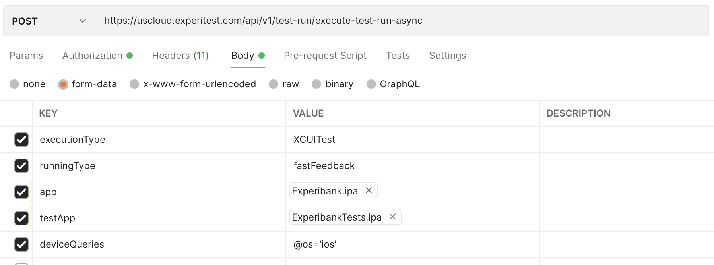
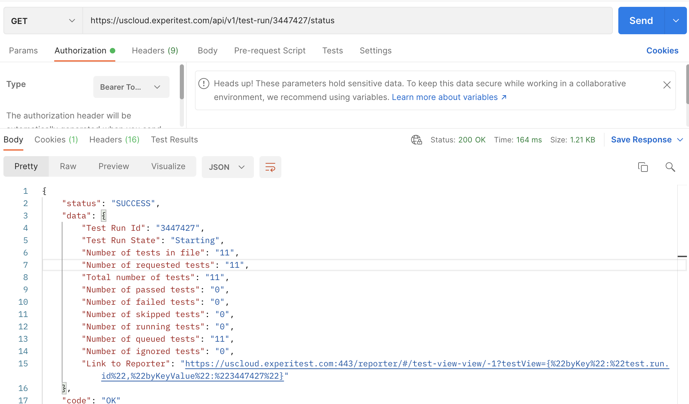
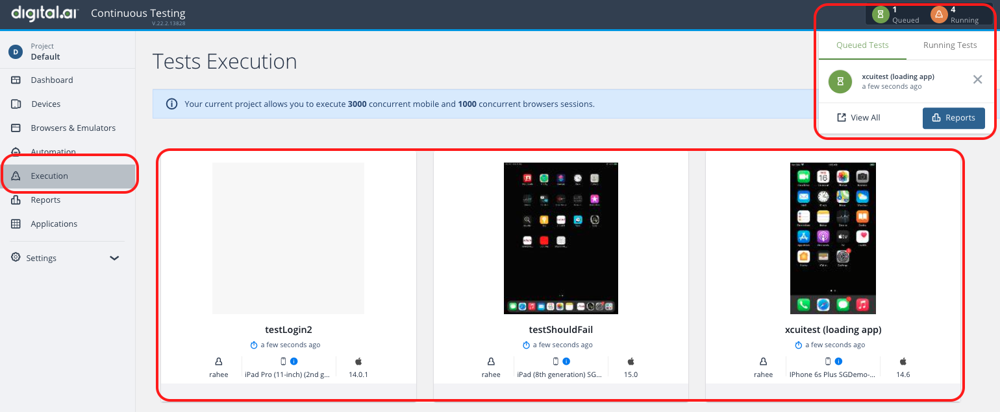
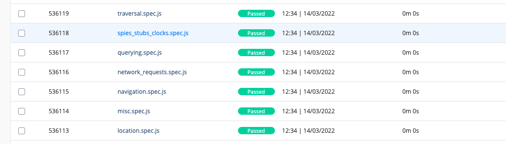
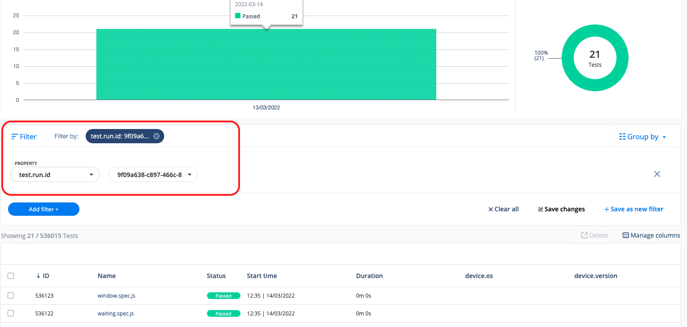

# XCUITest-With-Continuous-Testing-Digital-ai

This repository will briefly go over how to trigger XCUITest Unit Tests using a sample project against the Digital.ai's Continuous Testing platform.

Documentation Page References:

- [Preparing your App and Test Bundles](https://docs.experitest.com/display/TE/Preparing+your+App+and+Test+Bundles)

- [Rest API for running XCUITest Unit Tests](https://docs.experitest.com/display/TE/Manage+Test+Run+with+the+API#ManageTestRunwiththeAPI-RunningAsyncEspresso/XCUITest)

Sample IPAs can be downloaded here:

- [Experibank.ipa](https://experibankxcuitestapp.s3.us-east-2.amazonaws.com/Experibank.ipa)

- [ExperibankTests.ipa](https://experibankxcuitestapp.s3.us-east-2.amazonaws.com/ExperibankTests.ipa)

## Triggering XCUITest Unit Tests

To trigger XCUITest Unit Tests, we need to rely on an API call:

```
POST - /api/v1/test-run/execute-test-run-async
```

There are a number of parameters accepted, find a [full list of parameters here](https://docs.experitest.com/display/TE/Manage+Test+Run+with+the+API#ManageTestRunwiththeAPI-RunningAsyncEspresso/XCUITest).

Here is an example API Request done using Postman:



## Status of the API Run

Using the following API, we can get the status of the XCUITest Unit Tests:

```
GET - /api/v1/test-run/{id}/status
```

Here is an example API Request done using Postman:



## Viewing the Test Execution

We can also view the Execution Live, by following these steps:

1. Login to the SeeTest Cloud UI
2. Navigate to the Execution page:



## Viewing The Results

In the SeeTest Cloud UI, using the following steps, we can navigate to the SeeTest Reporter where the results are stored:

1. Login to the SeeTest Cloud
2. Click on your Initials > Go To Reporter:


3. Navigate to Tests tab:


If the execution was recent, it should show up in the list:



Otherwise also searching for the test results using the Filter option by searching with "test.run.id" followed with the Execution ID received from the API call:


